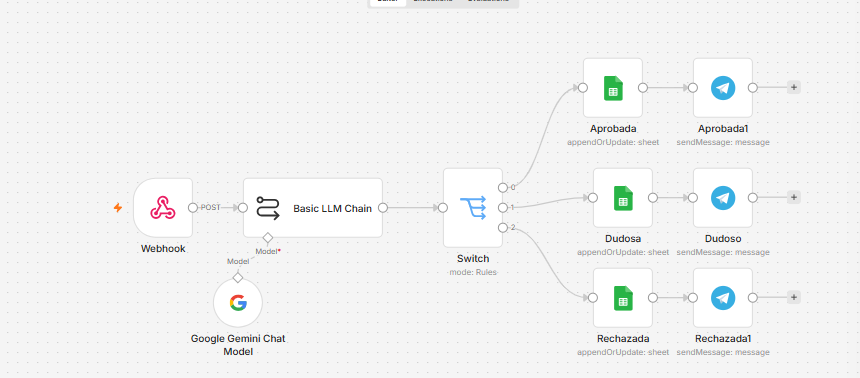
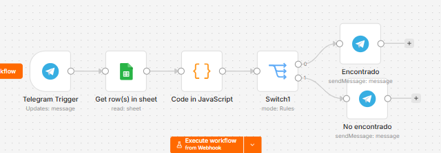

 Sistema Inteligente de Gestión de Justificación de Inasistencias

Este repositorio tiene la solución automatizada para la gestión de solicitudes de justificación de inasistencias estudiantiles. El sistema contiene un motor de automatización de procesos, inteligencia artificial para la evaluación de documentos de soporte (OCR y análisis contextual), almacenamiento en la nube y una interfaz de interacción y consulta mediante un bot de Telegram.

 Arquitectura del Sistema

El flujo de trabajo está diseñado de forma modular dentro de n8n y se divide en dos componentes funcionales principales:

 Módulo de Recepción y Análisis Automático:

 

* Las solicitudes se reciben en tiempo real mediante un nodo Webhook que simula la recepción de datos de un formulario web (Nombre, ID Estudiante, Correo, Motivo y Documento ).

* Los datos y archivos adjuntos son procesados por el nodo Basic LLM Chain utilizando el modelo Google Gemini Chat Model, el cual realiza una extracción automática de texto (OCR) y analiza la coherencia de la justificación.

* La IA emite un veredicto estructurado en formato JSON con la clasificación (Aprobada, Dudosa o Rechazada) y un nivel de confianza.

* Un nodo Switch evalúa el veredicto y bifurca el flujo hacia la hoja correspondiente en Google Sheets (Append or Update Row).

* El sistema manda una alerta directa al estudiante a través de Telegram (Aprobada, Dudoso o Rechazada) utilizando el chat_id capturado en el sistema.

Módulo de Consulta de Estado e Historial 

*  El estudiante interactúa con el bot enviando su número de carné o ID. El flujo se inicia mediante el nodo Telegram Trigger.

* Se utiliza el nodo Google Sheets para buscar coincidencias por el campo ID. Al recuperar múltiples registros, permite obtener la colección completa de inasistencias vinculadas a ese alumno.

* Se integra un nodo Code in JavaScript que ejecuta un script. Este componente recorre el arreglo de objetos devuelto por la base de datos, extrae las variables clave y las unifica de manera ordenada en un único mensaje de texto enriquecido.

* Evalúa de forma booleana si el estudiante posee registros en el sistema. Si el resultado es verdadero (true), dirige la ejecución hacia la salida 0 (Encontrado); de lo contrario, se desvía a la salida 1 (No encontrado).

* El nodo de Telegram final recibe el bloque formateado y lo entrega de golpe en el chat, optimizando la visualización del historial en entornos de mensajería sin fragmentar las alertas.

